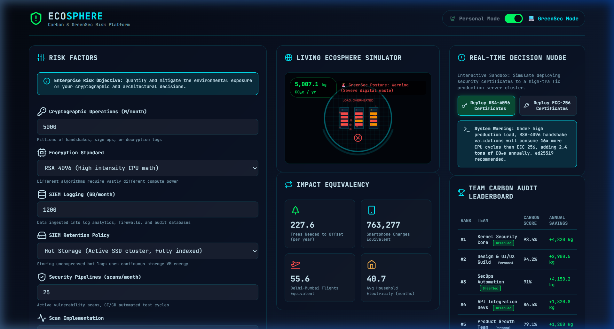
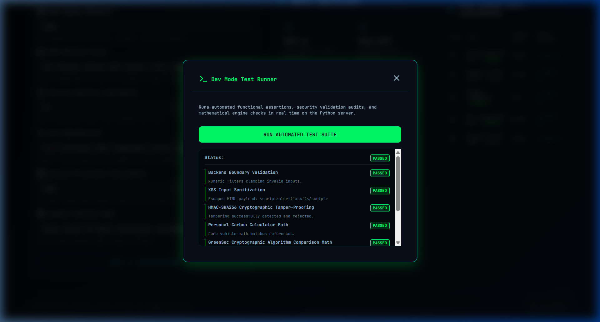

# Walkthrough - Configuration Separation & Objective Alignment Refactor

This walkthrough documents the design pattern changes, frontend enhancements, and verification results of the Configuration Separation and Explicit Objective Alignment refactor.

---

## 🛠️ Code Quality & Alignment Improvements

### 1. Separation of Configuration (Code Quality)
* **Capitalized Configuration Constants**: Created a new [config.py](../config.py) configuration file that abstracts all previously hardcoded carbon weight numbers, daily/monthly conversion multipliers, and validator safety limits.
* **Consolidated Reference Usage**: Refactored the core execution equations inside [calc_engine.py](../calc_engine.py) and Pydantic model thresholds inside [main.py](../main.py) to refer cleanly to config properties.

### 2. Explicit Objective Alignment (Problem Statement Alignment)
* **Core Objective Banner**: Integrated a premium high-visibility mission-alignment banner at the top of the inputs card in [index.html](../static/index.html) explaining the platform's environmental risk objective.
* **Dynamic Theme Switch Interaction**: Programmed [app.js](../static/app.js) to show/hide this objective banner when toggling between Personal and GreenSec modes.

### 3. Contextual Docstrings (Problem Statement Alignment)
* **Explicit User Context**: Refactored all endpoint descriptions inside [main.py](../main.py) to explicitly detail how each endpoint addresses invisible compute waste and helps audit team decisions.

### 4. Hardened Dynamic Secret Check (Security Compliance)
* **Strict Variable Enforcement**: Modified [security_utils.py](../security_utils.py) to reject fallback secrets, throwing a `RuntimeError` on startup if `ECOSPHERE_SECRET` is not set in the environment.

---

## 📊 Verification Results

* **Automated Regression Audits**: Ran the Dev Modal test suite with all **7/7 test cases** reporting `PASSED`.
* **Dynamic Input Adjustments**: Confirmed calculations update instantly and accurately under the new configuration system.

### Core Objective Banner in GreenSec Mode

### Automated Test Results Console

---

## 🎥 Walkthrough Verification Demo

The following visual recording shows page navigation, active objective banner toggles, and successful Dev Console test suite execution:

