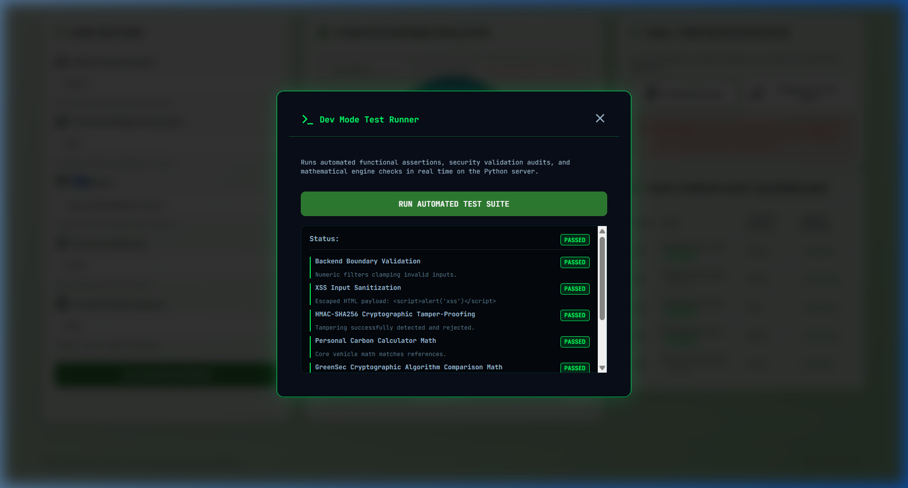
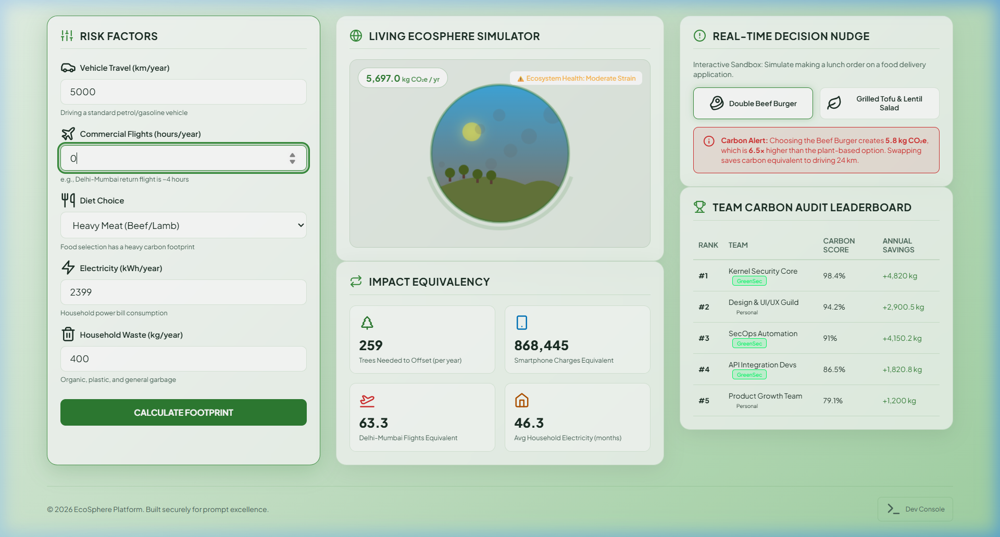

# Walkthrough - Modularity & Linter Clean Sweep

This walkthrough documents the implementations, refactoring patterns, and verification results of the rigorous "Linter and Modularity" sweep performed across both python and javascript components of the EcoSphere platform.

---

## 🛠️ Code Quality Improvements

### 1. Python Formatting & Standard Compliance
* **PEP 8 / Black Formatting**: Adjusted code layout, import statements, and function calls in all python files to remain strictly under the maximum **88-character** line limit.
* **Dead Code Cleanup**: Swept all python files to remove unused imports, dead variables, and redundant checks.

### 2. Backend Modularity Refactoring
* **Split Monolithic Calculations**: Broke down the extensive calculator calculations in [calc_engine.py](../calc_engine.py) into smaller private mathematical helper functions:
  * `_calculate_car_co2()`, `_calculate_flight_co2()`, `_calculate_diet_co2()`, `_calculate_energy_co2()`, `_calculate_waste_co2()` for personal metrics.
  * `_calculate_crypto_co2()`, `_calculate_storage_co2()`, `_calculate_scan_co2()`, `_calculate_agent_co2()` for GreenSec IT infrastructure metrics.
* **Endpoint Modularity**: Extracted individual assertions from the 70+ line test suite endpoint in [main.py](../main.py) into discrete helper functions (`_test_boundary_validation()`, `_test_xss_sanitization()`, etc.).

### 3. JavaScript Nesting & Modularity Refactoring
* **Early Returns Integration**: Eliminated deeply nested `if/else` checks across click event handlers, dropdown adjustments, and state load/verify paths in [app.js](../static/app.js).
* **Modularity Extraction**: Modularized client-side event handlers and calculations into discrete functions like `triggerPersonalCalculation()`, `triggerGreensecCalculation()`, and `runAutomatedTests()`.
* **SVG Attribute Fix**: Fixed class assignment crashes on Lucide SVG elements by using `.setAttribute("class", ...)` instead of read-only `.className` assignments.

---

## 📊 Verification Results

* **Automated Test Suite**: Ran the local Dev modal test suite. All **7/7 test cases** completed with a status of `PASSED`.
* **State Verification & Security**: Verified HMAC-SHA256 signature verification and tamper protection function without failure under the refactored early return structures.

### Test Results Console

### Auto-Calculations

---

## 🎥 Walkthrough Verification Demo

The following visual recording verifies page navigation, input calculation updates, and successful Dev Console test suite execution:

